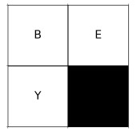

# Solving the crossword

* [Used technologies](#used-technologies)
* [Problem description](#problem-description)
* [How the algorithm works](#how-the-algorithm-works)
* [Results (with backtracking search)](#results-with-backtracking-search)

## Used technologies
* Python
* Numpy
* Matplotlib

## Problem description

There is a board of size: n x m fields to be used as a canvas for a crossword. A set S of all English words (or for any other natural language) can be used to select words from, but only k of them can be used in a crossword. The problem parameters are: S, n, m and k. We need to find such a way of placing words across the board that one field includes at most one letter and every continuous sequence of letters read horizontally or vertically is a word from the selected subset of the size k of S. A solution must include exactly k words from S. Some fields of the board can be left empty.

The list of English lemmas are extracted from the British National Corpus prepared by Prof. Adam Kilgarriff: https://www.kilgarriff.co.uk/bnc-readme.html . There are selected from the list only: adverbs (adv), verbs (v), adjectives (a) and nouns (n).

## How the algorithm works

The program is an example of constraint satisfaction problem. It can use either backtracking search algorithm or search with forward checking heuristic.

Example board:

Board is n x m matrix

Blue – vertically, 
Green – horizontally, 
Red - constraint 

Variables:

Domains:

Domain contains lemmas from English language – adverbs, verbs, adjectives and nouns – selected respective for the word size i.e.:

Constraint:

## Results (with backtracking search)

Board size: 2x2 
Time elapsed: 0.009027481079101562 
Result:

Board size: 4x4 
Time elapsed: 0.01701951026916504 
Result:

Board size: 4x6 
Time elapsed: 0.3980727195739746 
Result:

Board size: 6x4 
Time elapsed: 0.04613971710205078 
Result:

Board size: 6x6 
Time elapsed: 10.678395986557007 
Result:

